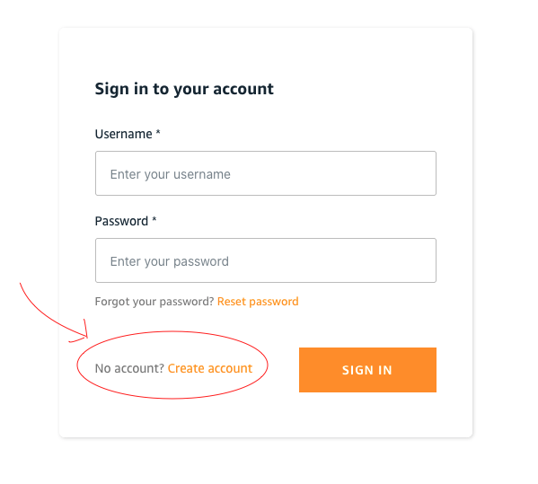

# Testing The Front End (local)

We now want to launch the front end to verify all of our previous steps have been completed
successfully. In this step, we will **not** be deploying the front end and only
running it locally.

Perform all of the following steps in the [/marketplace](/marketplace) directory.

## Launch

Run the following command to set the front end environment variables.

```bash
cat <<EOF > .env.local
VUE_APP_AWS_REGION=<region>
VUE_APP_API_ENDPOINT=<api-endpoint>
VUE_APP_USER_POOL_ID=<user-pool>
VUE_APP_USER_POOL_WEB_CLIENT_ID=<web-client>
EOF
```

Replacing the values enclosed in `<>` with the value as follows (omitting the `<>` in your own value):

| Placeholder      | Source                                               |
| ---------------- | ---------------------------------------------------- |
| `<region>`       | The region you deployed your stack in previous steps |
| `<api-endpoint>` | `NftApiEndpoint` output from [Deploy API][1]         |
| `<user-pool>`    | `UserPoolId` output from [Deploy API][1]             |
| `<web-client>`   | `UserPoolClientId` output from [Deploy API][1]       |

Then run the following command to install the dependencies for this element of the project.

```bash
npm install
```

Finally, run the following command to start the local webserver and listen on
`localhost:8080`.

```bash
npm run serve
```

Go to your browser at <http://localhost:8080>. If the site loads without errors,
everything from the previous steps have been completed successfully.

## Create an account

When <http://localhost:8080> loads, you will see a login page.  In order to proceed here,
you will need to create a new account.  This will utilize Amazon Cognito to create and
validate a new account, so you will need to do the following:

At the login screen, choose to create a new account using the 'No Account Create One' selection as shown.


On the `Create a new account` screen, enter a Username, password, and a *valid email address* as you will
need to verify with a verification code (sent to this email) to sign up.

> *What are we doing here?* As part of the previous deployment, we created a cognito Identity User pool
> in *Your AWS Account* to control access to the marketplace.  This information is only available to your
> account for authentication, therefore this information does not get used or shared externally in any way.

## Eth Deposit

After you have verified your account, click the "Account" button in the upper right-
hand corner of the page where you will see the following information:

- Address: Public Address
- Balance: The balance of deposited Ethereum
- Private Key: The private key of the wallet. Display by pressing the "Retrieve" button

A certain amount of Ethereum is required to create and transfer NFTs. Therefore,
you need to deposit a test Ethereum to the address shown on the website as you
did in [Deploy Contract][2].

Once the deposit is complete, reload the Account page until the balance shown is
greater than 0.

## Creating an NFT

Click the "Home" button in the upper left to move to the first page, and press
"Create NFT" to move to the NFT creation page. Upload an appropriate image file,
enter a title and description, and press "CREATE". When the creation is completed,
you will automatically be taken to the NFT details page.

## Confirmation and transfer of NFT

The NFT details page shows the title, description, and owner's address you've set.
The owner is initially the creator of the NFT and the owner is the user who is able
to transfer the NFT.

Specify an appropriate address (example: `0xE36409e343896a10078500E4a8314375c3B0c24b`)
to transfer the NFT to at the bottom, and execute.

When the transfer is complete, the page will automatically reload and you can see
that the owner has a different address and your current user is no longer able
to transfer since they no longer own the NFT.

## Next Step

### [Deploy Front End][3]

[1]:./DOCS_03_DEPLOY_API.md
[2]:./DOCS_02_DEPLOY_CONTRACT.md
[3]:./DOCS_05_DEPLOY_FRONTEND.md
